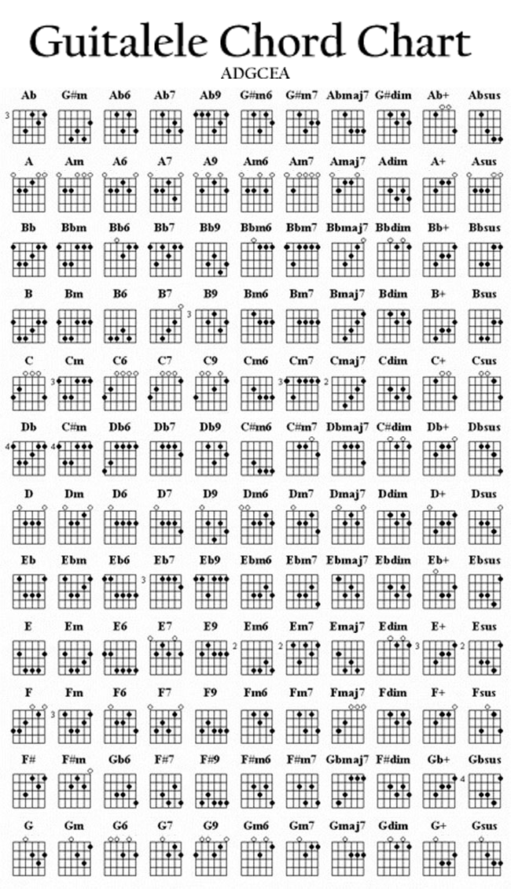
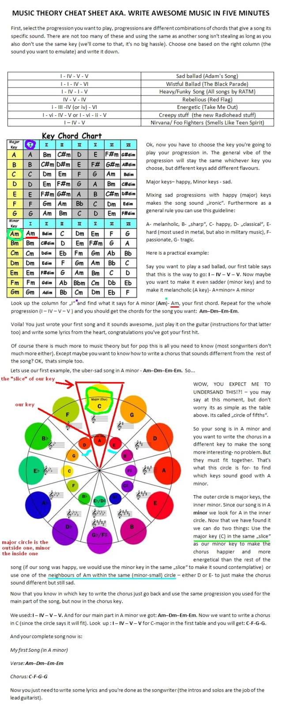

# Music

## Guitalele chord chart

## Theory cheat sheet

Create sheets: https://www.hacklily.org/

## lyrics

### Jesus gjor meg stille

Jesus gjor meg stille, stille ("jesus iör mai stille, stille")
La meg hvilde i din trost ("la mei ville i din tröst")
Når meg sa tan vil forvilde ("na mai satan vil forville")
La meg høre blott din rost ("la mei hoore bloot din röst")

Tal du till mitt trette hjerte ("tal du til mi träte hijärte")
Skjenk det herre salig ro ("schenk de härre salin ruh")
Og fordriv alnod og smerte ("o fordirv alnöd o smärte")
Styk min hap og ok min tro ("stük min hoop o ok min tru") 

Vokt du meg for hver en fare
nar jeg tankelos gar frem
fra den onde skjulte snare
frels meg du, min gud og venn

jesus dann min egen vilje
sa den helt gar opp i din
at ei noget oss ma skille
men du helt og fullt blir min

https://www.ensemblevocaladventi.fr/IMG/pdf/307_Jesus_gjor_meg_stille.pdf
